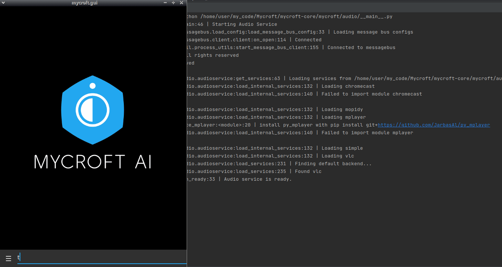

#  Wikipedia
Wikipedia

## About 
Query [Wikipedia](https://www.wikipedia.org) for answers to all your questions.  Get just a summary, or ask for more to get in-depth information.

## Examples 
* "Tell me about Elon Musk"
* "Tell me about beans"
* "Check Wikipedia for beans"
* "Tell me about the Pembroke Welsh Corgi"
* "Search for chocolate"
* "More information" (followup after an initial summary)
* "Tell me More" (followup after an initial summary)

## Category
**Information**

## Tags
#wikipedia
#encyclopedia
#general-knowledge
#wiki
#question
#query
